# PnL Tracker

A single-user portfolio tracker and trading journal for a **Rakuten Securities** (楽天証券)
account. It imports Rakuten's Shift-JIS CSV exports, computes realized and unrealized P&L
under Japanese cost-basis rules, tracks NISA quota against the ¥18M lifetime cap, estimates
the tax bill, and pairs all of it with a day-by-day journal.

Japanese equities, US equities and 投資信託 funds, across 特定口座 and all three NISA account
types.

---

## Screens

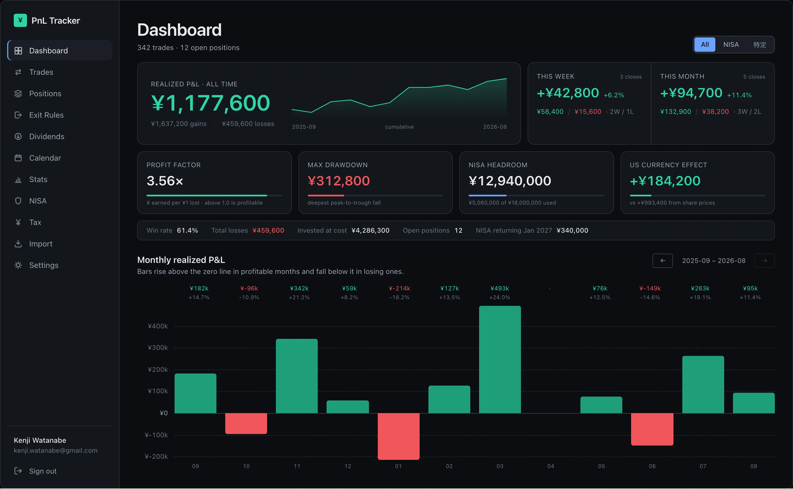

<details>
<summary><b>Positions</b> — open holdings, allocation and unrealized P&L</summary>

Market value leads, with an allocation bar across 特定 / NISA 成長 / NISA つみたて / 旧NISA.
Unrealized gains are drawn as zero-origin bars, since they are signed. Positions with no
quotable price say so rather than silently valuing at cost.

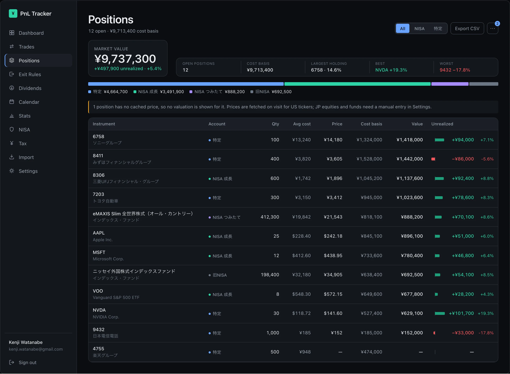

</details>

<details>
<summary><b>Calendar</b> — realized P&L per day, and the journal</summary>

Each cell is tinted by that day's realized P&L, stronger for larger. Clicking a day opens
the journal entry, where mood and motivation are scored 1–5 so they can be correlated
against results on the Stats screen.

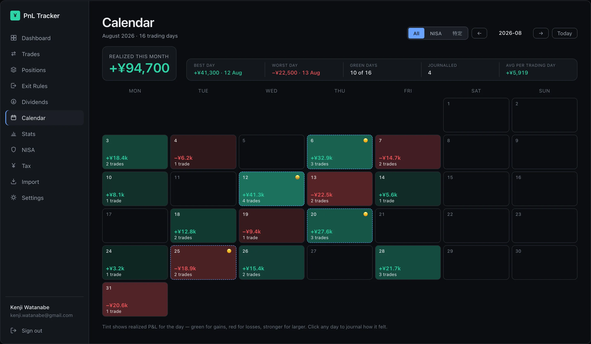

</details>

<details>
<summary><b>Stats</b> — win rate, profit factor, drawdown, and what drove the result</summary>

US realized P&L is split into share-price movement versus yen movement versus costs — the
three components sum exactly to the total, so it is visible how much of a US result was
really the FX rate. Journalled days are bucketed by the mood and motivation score given that
day.

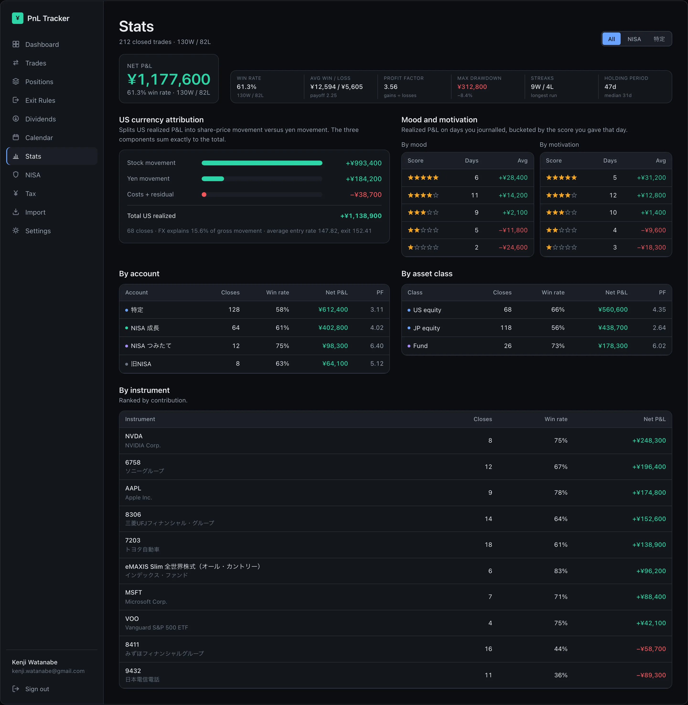

</details>

<details>
<summary><b>NISA</b> — the ¥18M lifetime cap and the annual frames</summary>

Headroom leads, because it is the only figure on the page that can be acted on. One
segmented bar carries 成長投資枠 held, つみたて投資枠 held, the pending restoration (hatched)
and the ¥12M 成長 sub-cap tick. Annual frames are shown as *remaining*, not used, because
that is the number that expires on 31 December.

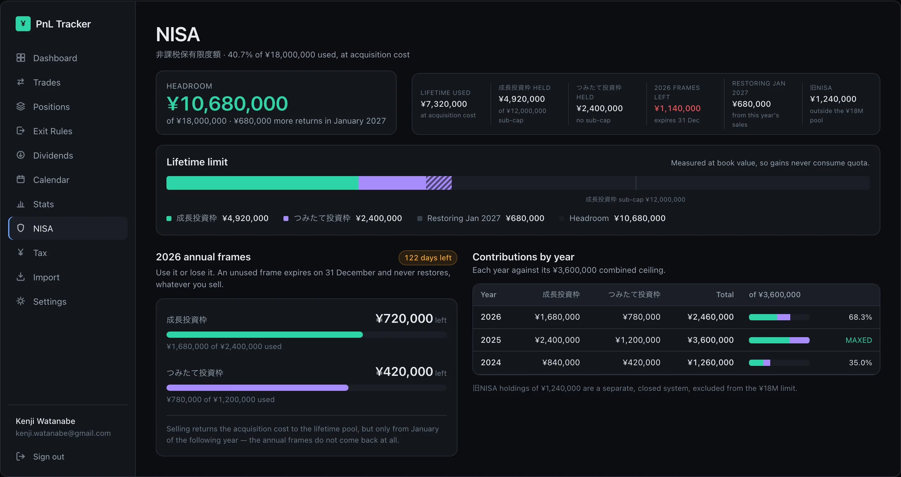

</details>

<details>
<summary><b>Tax</b> — how the year gets to its estimated bill</summary>

A derivation band rather than a grid of tiles: taxable gains − taxable losses = net taxable,
× 20.315% = estimated tax, then net after tax. Attribution is by 受渡日 (settlement date),
matching how Rakuten actually reports and withholds. Estimates only — not tax advice.

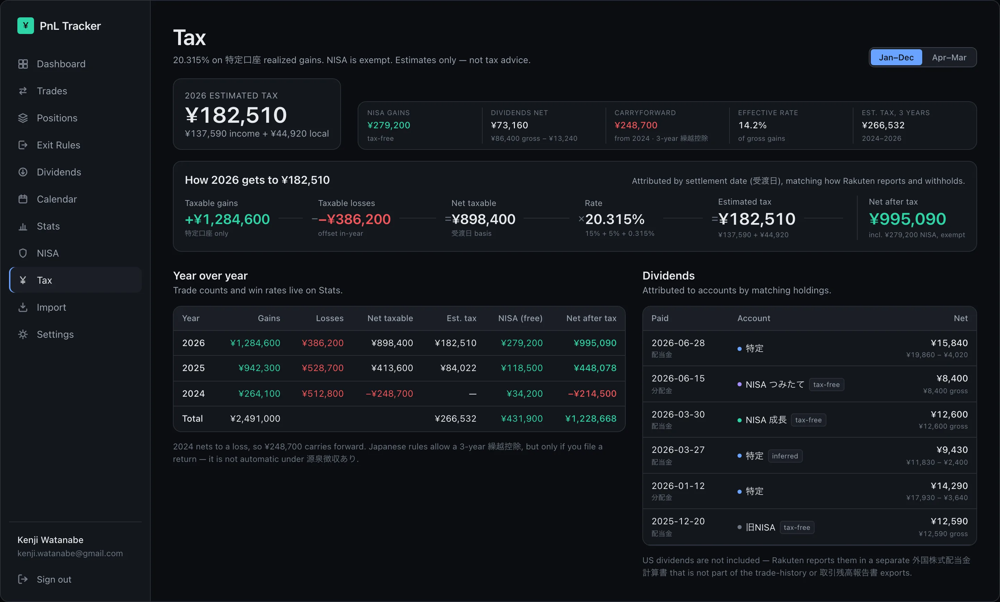

</details>

<details>
<summary><b>Dividends</b> — 配当金 and 分配金, gross, withheld and net</summary>

Net received leads — the cash that actually landed. Gross is reconstructed from the credited
amount, because Rakuten's 取引残高報告書 reports only what it paid out and never the pre-tax
figure. Rows whose account had to be inferred are tagged as such.

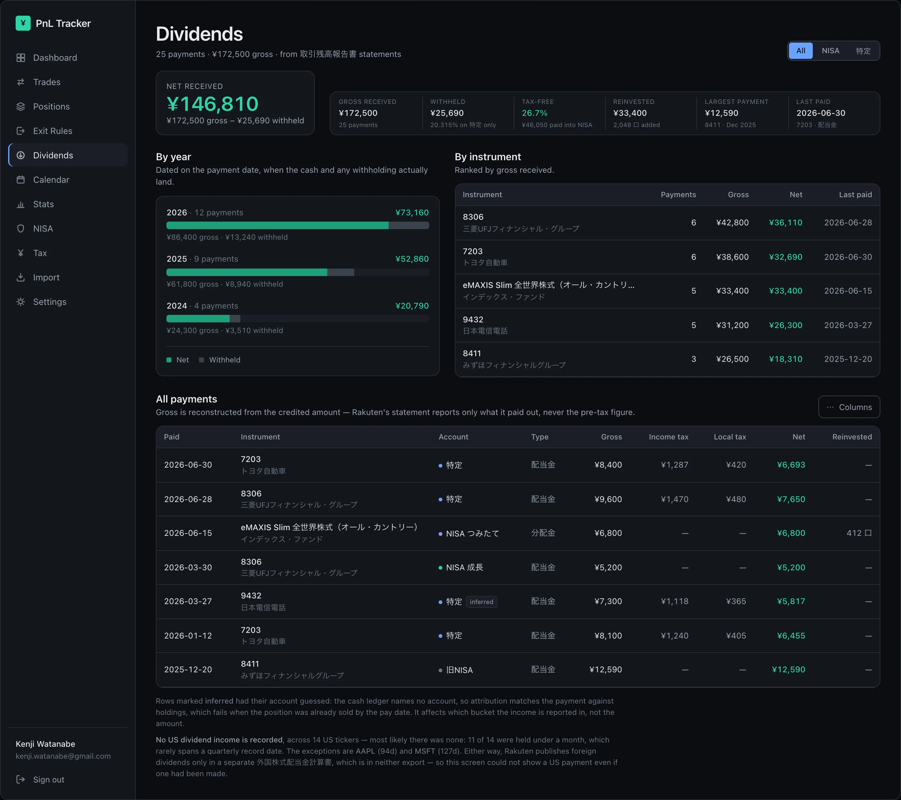

</details>

<details>
<summary><b>Exit Rules</b> — a swing-trade exit framework fed by TradingView</summary>

Plans the framework rates urgent or needing attention keep a full card; plans that are on
track collapse into one row each. Stops, R and Target 1 are locked at entry and never
recomputed. Everything path-dependent — the highest close, the Target 1 latch, the ratcheting
trail — is replayed from stored daily bars rather than mutated.

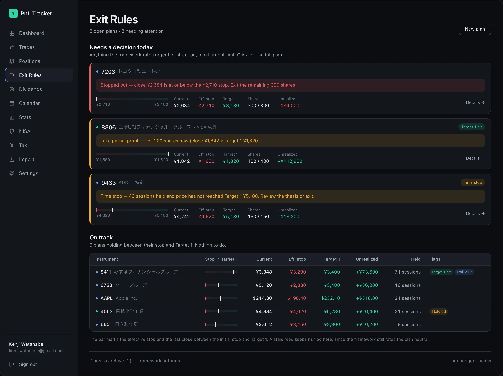

</details>

<details>
<summary><b>Mobile</b> — the same screens at 390px</summary>

Each screen collapses onto segmented tabs, and charts that would be cramped flip to
horizontal bars measured off a zero line.

<table>
<tr>
<td align="center">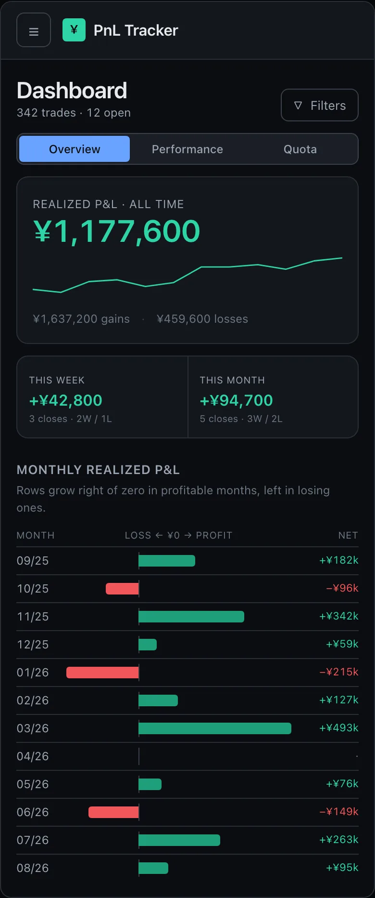<br><sub>Dashboard</sub></td>
<td align="center">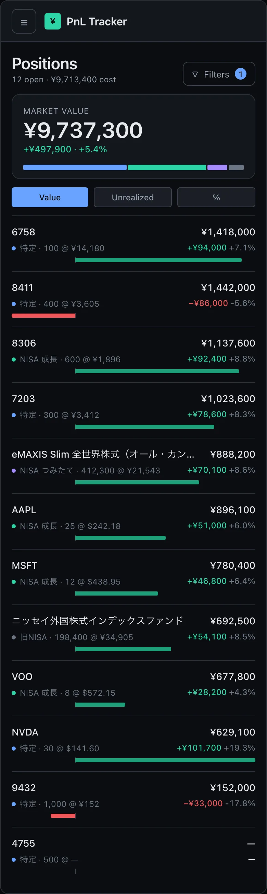<br><sub>Positions</sub></td>
<td align="center">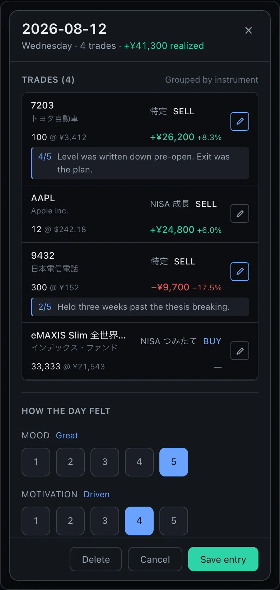<br><sub>Calendar</sub></td>
<td align="center">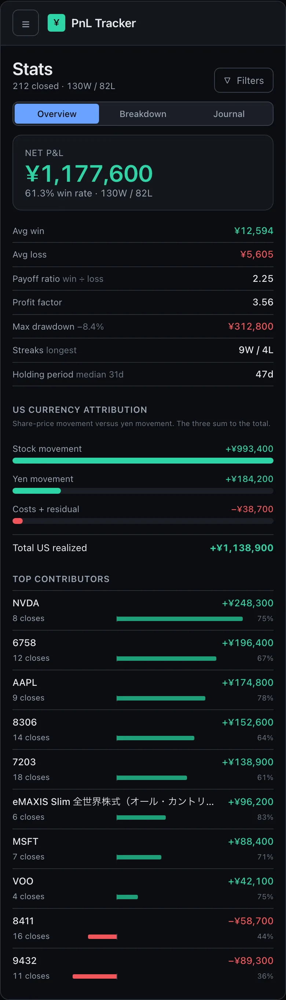<br><sub>Stats</sub></td>
</tr>
<tr>
<td align="center">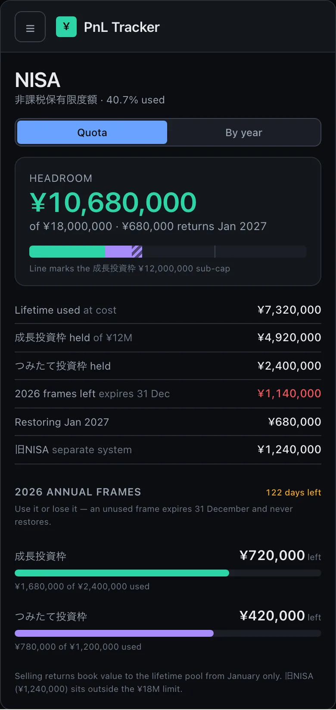<br><sub>NISA</sub></td>
<td align="center">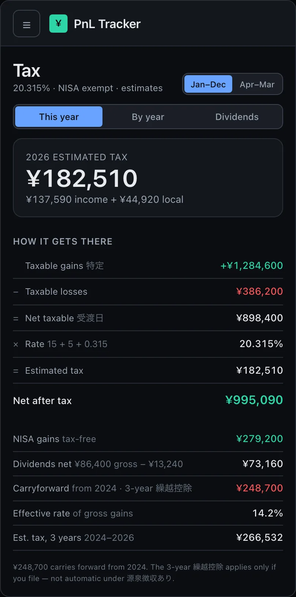<br><sub>Tax</sub></td>
<td align="center">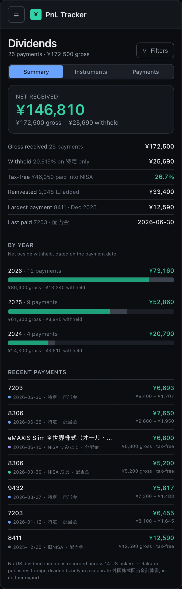<br><sub>Dividends</sub></td>
<td align="center">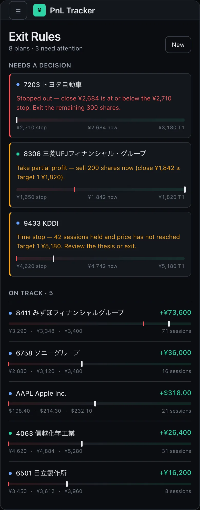<br><sub>Exit Rules</sub></td>
</tr>
</table>

</details>

> **About these images.** They are captured from the design-handoff mocks, not from a running
> instance, and every figure in them is invented — internally consistent, but not anyone's
> portfolio. This repository is public and the live database holds a real Rakuten account, so
> screenshotting the deployed app would publish actual holdings. The layouts are the shipped
> ones.
>
> `node scripts/screenshots.mjs` regenerates them, but the mock bundle it reads
> (`design_handoff_content_redesign*/`) is gitignored along with the other design handoffs, so
> a fresh clone cannot rerun it. Trades, Import and Settings have no mock and are not shown.

---

## What it does

- **Imports** the three `tradehistory` exports (JP / US / INVST) plus the monthly
  取引残高報告書, deduplicated so re-importing an overlapping export is a no-op.
- **Computes cost basis** with 移動平均法 (moving weighted average), pooled per
  (instrument × account type).
- **Prices** open positions through Finnhub (US), a JP scrape, or a manual override,
  degrading to the last-known price rather than failing the render.
- **Tracks NISA** — annual frames, the ¥18M lifetime cap at book value, the ¥12M 成長 sub-cap,
  and the acquisition cost that restores each January.
- **Estimates tax** at 20.315% on 特定口座 realized gains, calendar-year on a 受渡日 basis,
  with 3-year 繰越控除 carryforward.
- **Journals** each trading day with a 1–5 mood and motivation score, correlated against that
  day's realized P&L.
- **Manages exits** with a swing-trade framework — ATR-based initial stop, an R-multiple
  Target 1, a partial exit, then a ratcheting Chandelier trail — fed by a TradingView webhook.

## Domain rules that are easy to get wrong

Each of these cost real debugging time, and each is now enforced by tests. `PLAN.md` has the
full derivation and sources.

- **Cost basis is 移動平均法**, which Japanese tax rules require. FIFO produces different — and
  for filing purposes wrong — numbers. There is consequently **no link between an individual
  buy and an individual sell**; units are fungible within a pool.
- **Pools are keyed (symbol × accountType).** The same ticker in 特定 and NISA is two
  independent tax lots. Commingling corrupts both P&L and the NISA quota.
- **Money is `Decimal`, never a float.** DB columns are `numeric(24,8)`; JPY results round to
  whole yen.
- **Fund prices (基準価額) are quoted per 10,000 口** and divided down at parse time.
- **`税金等` in the JP CSV is consumption tax on commission, not capital gains tax.**
  Capital-gains withholding appears in no export and is estimated.
- **The tax year is the calendar year on a 受渡日 basis** — not the trade date, and not
  April–March (that is 年度, the fiscal year).
- **Unsettled rows carry `受渡金額 = "-"`**; the amount must be derived and `isSettled` set false.
- **`再投資` rows are zero-cash buys** that add units *and* cost basis.
- **旧NISA is a separate, closed system**, excluded from the ¥18M lifetime cap.

## Architecture

Data flows one way, and the engine is the single source of truth:

```
Shift-JIS CSV → parser → NormalizedTrade[] → runEngine() → server fn → route loader → UI
```

`src/lib/` is **pure and DB-free** — parsers, the P&L engine, NISA quota, tax and stats are
plain functions over plain data. That is what makes them testable against the real CSVs with
no database. The UI never does financial arithmetic: server functions return already-formatted
strings and components only render them.

| Path | Role |
|---|---|
| `src/lib/domain/types.ts` | `NormalizedTrade`, `AccountType`, `TradeSide`, shared constants |
| `src/lib/import/tradeHistory.ts` | `detectFormat` + the three trade parsers |
| `src/lib/import/torizan.ts` | month-end statements: dividends, snapshots, cash |
| `src/lib/pnl/engine.ts` | `runEngine` — cost basis and realized events |
| `src/db/import.service.ts` | two-phase `previewImport` / `commitImport` |
| `src/server/screens.ts` | one server function per screen |
| `src/lib/exit/rules.ts` | the swing-trade exit framework |
| `src/routes/api/tv/$secret.ts` | TradingView webhook — the only unauthenticated route |

Every server function touching user data carries `.middleware([authed])`, which supplies a
typed `context.userId` — a handler that forgets the check does not compile.

`src/lib/pnl/reconcile.test.ts` replays the engine against 10 month-end 取引残高報告書
snapshots. It is the strongest correctness check here: a cost-basis or ordering bug that would
survive an end-state comparison fails at the month it starts.

## Stack

React 19 · TanStack Start / Router · Drizzle + Neon Postgres · Better Auth (Google, hard
email allowlist) · SCSS Modules + Radix primitives · decimal.js · Vitest. Deployed on Vercel.

No Tailwind, no shadcn, dark theme only. All colour goes through `--color-*` / `--chart-*`
tokens in `src/styles/_tokens.scss`.

## Running it

```bash
npm install
npm run dev          # Vite dev server on :3000
npm run build        # production build → .output/
npm test             # vitest run
npm run typecheck
npm run lint
npm run db:push      # apply the schema to DATABASE_URL
```

Verification loop for any change: `npm run typecheck && npm run lint && npm test`.

`.env` keys — see [SETUP.md](SETUP.md) for the full checklist:

| Key | Purpose |
|---|---|
| `DATABASE_URL` | Neon **pooled** (`-pooler`) host |
| `BETTER_AUTH_SECRET`, `BETTER_AUTH_URL` | session signing and callback base |
| `GOOGLE_CLIENT_ID`, `GOOGLE_CLIENT_SECRET` | the only sign-in provider |
| `ALLOWED_EMAIL` | hard allowlist; empty fails closed |
| `FINNHUB_API_KEY` | US quotes |
| `TRADINGVIEW_WEBHOOK_SECRET` | 24+ chars; forms the `/api/tv/<secret>` path. Unset disables the exit-rules feed rather than failing |

### The test suite needs data that is not in this repo

`csv/` holds the owner's actual Rakuten exports and is gitignored. `loadFixtures.ts` reads it
directly, because synthetic data does not reproduce the quirks this code exists to handle.
**Without `csv/`, 62 tests across 12 files fail** — a fresh clone cannot run the suite until
those exports are restored.

## Documentation

- [`PLAN.md`](PLAN.md) — the original design document, with the full derivation of every
  domain rule and the validation strategy
- [`SETUP.md`](SETUP.md) — environment checklist
- [`docs/exit-rules.md`](docs/exit-rules.md) — the exit framework and why entry facts are locked
- [`docs/server-only-modules.md`](docs/server-only-modules.md) — how server code leaks into a
  client bundle, and the build check that now prevents it
- [`CLAUDE.md`](CLAUDE.md) — working notes for agents

## Licence

Personal project, no licence granted.
